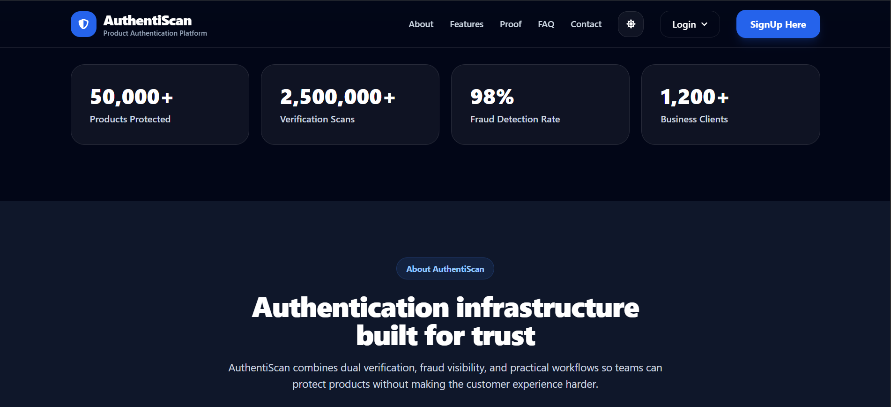
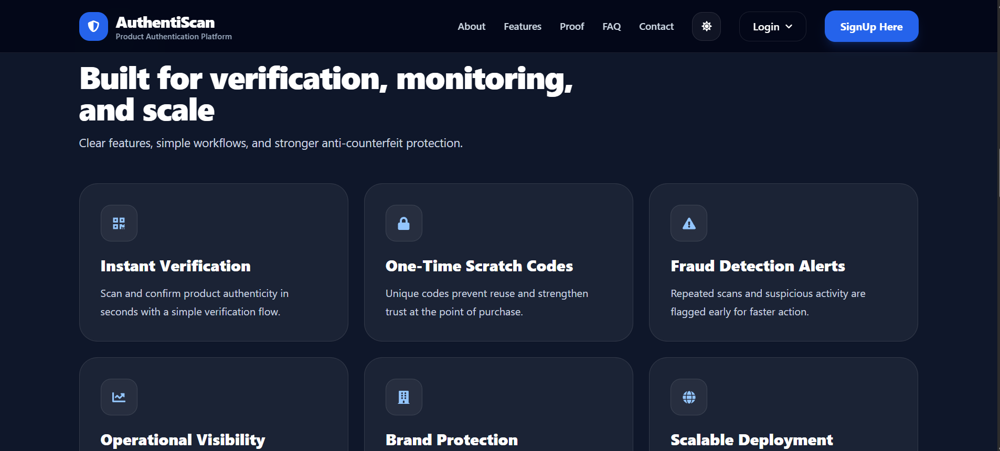
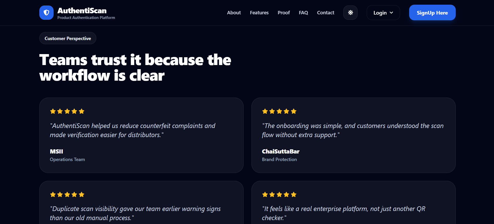
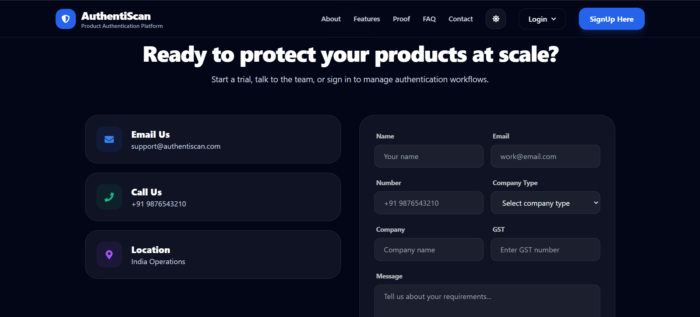
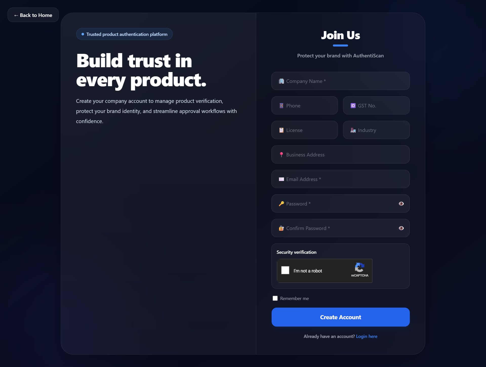
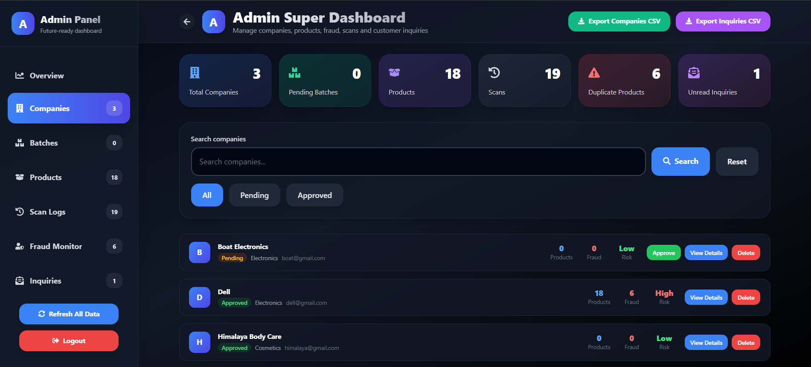
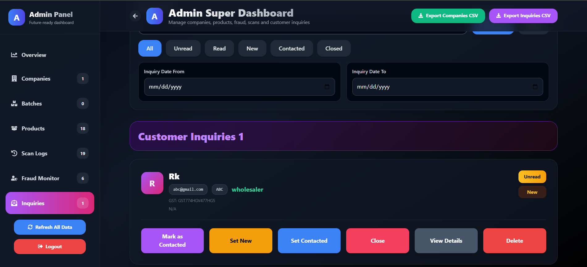

# 🛡️ AuthentiScan - QR Based Product Authenticity Scanner (Manufacturer Side)

<div align="center">


### Centralized Product Registration & QR Generation System

A web-based manufacturer portal that enables organizations to register products, generate QR codes and scratch verification codes, manage inventory records, and provide product data for verification through the AuthentiScan Android application.

</div>

---

## 🌐 Live Demo

**Manufacturer Portal**  
👉 https://authentiscan-3478a.web.app/

**Android Application (APK):**
Download the latest APK from the Android repository Releases section.

---

## 🔗 Related Repository

**This project is part of the AuthentiScan ecosystem.**
 - 🏭 Manufacturer Portal (React)
 - 📱 Consumer Android Application (Kotlin)
 - ☁️ Firebase Backend (Authentication, Firestore, Storage)

Together they provide a complete QR-based product authenticity verification system.

| Repository | Link |
|------------|-------------|
| **Manufacturer Portal** | https://github.com/Ritesh000001/product-authenticity-web |
| **Android Application** | https://github.com/Ritesh000001/product-authenticity-android |

---

## 📌 Problem Statement

Counterfeit products are a major challenge across industries such as electronics, pharmaceuticals, cosmetics, FMCG, and consumer goods.

Even when consumers attempt to verify products, there is often no centralized platform where manufacturers can securely register genuine products and make them available for verification.

To solve this problem, AuthentiScan introduces a centralized product authentication ecosystem consisting of:

🏭 **Manufacturer Portal (This Project)**

Used by manufacturers/admins to:

- Register products
- Upload product information
- Generate QR codes
- Generate scratch verification codes
- Manage product records

📱 **Consumer Android Application**

Used by customers to:

- Scan QR codes
- Verify product authenticity
- Validate scratch codes
- Detect duplicate scans
- Report suspicious products

---

## 🚀 Overview

AuthentiScan Manufacturer Portal acts as the central data management system of the entire authentication ecosystem.

Every product added through this portal receives:

- Unique Product ID
- Batch no.
- QR Code
- Scratch Verification Code
- Product Details
- Manufacturing Date
- Expiray Date
- Product Image

All information is securely stored in Firebase Firestore.

When a consumer scans a QR code using the Android application, the app retrieves product information directly from Firestore and verifies authenticity based on the data created through this portal.

---

## ✨ Features

### 🔐 Authentication

- Manufacturer Login
- Firebase Authentication
- Secure Session Management

---

### 📦 Product Management

- Add New Products
- Update Product Information
- View All Products
- Product Search Functionality

---

### 🔳 QR Code Generation

- Automatic QR Code Creation
- Product-specific QR Codes
- Unique Product Mapping

---

### 🎟 Scratch Code Generation

- Random Verification Codes
- One-Time Product Authentication
- Counterfeit Protection Layer

---

### 📋 Inventory Dashboard

- Total Products Count
- Category Tracking
- Product Monitoring

---

### ☁ Cloud Integration

- Cloud Firestore Database
- Firebase Authentication
- Firebase Storage

---

## 🏗 Architecture

<div align="center">

+----------------------+
| Manufacturer Portal |
|      React.js       |
+----------+----------+
           |
           v
+----------------------+
| Firebase Auth       |
+----------+----------+
           |
           v
+----------------------+
| Cloud Firestore     |
+----------+----------+
           |
    +------+------+
    |             |
    v             v
Products      Users
Collection   Collection
    |
    v
+----------------------+
| Android Application |
+----------------------+
           |
           v
Product Verification

</div>

---

## 🔄 Complete System Workflow

<div align="center">

Manufacturer/Admin
        |
        v
Login to Web Portal
        |
        v
Add Product
(Name, Batch, Image, Dates)
        |
        v
Generate Product ID
        |
        v
Generate QR Code
        |
        v
Generate Scratch Code
        |
        v
Store Data in Firestore
        |
        |
        +----------------------+
                               |
                               v
                       Android Application
                        (Consumer Login)
                               |
                               v
                         Scan QR Code
                               |
                               v
                      Fetch Product Data
                               |
                               v
                       Verification Logic
                               |
               +---------------+---------------+
               |               |               |
               v               v               v
           Genuine          Fake       Suspicious

</div>

---

## ⚙️ Tech Stack

| Component | Technology |
|-----------|-----------|
| **Frontend** | React.js |
| **Backend** | Firebase Authentication , Cloud Firestore , Firebase Storage |
| **Libraries** | QRCode Library |
| **Database** | Cloud Firestore |
| **Authentication** | Firebase Authentication |
| **Hosting** | Firebase Hosting |

---

## 📸 Screenshots

**Landing Page**
<div align="center">
  


</div>

---

**About**
<div align="center">
  


</div>

---

**Features**
<div align="center">
  


</div>

---

**Testimonials**
<div align="center">
  


</div>

---

**Contact**

<div align="center">
  


</div>

---

**SingUp**

<div align="center">
  


</div>

---

**Login**

<div align="center">
  


</div>

---

**Manufacturer Dashboard**

<div align="center">
  


</div>

---

**Admin Dashboard**

<div align="center">
  




</div>

---

## 🛠️ Setup Instructions

1️⃣ **Clone Repository**

```bash
git clone https://github.com/Ritesh000001/product-authenticity-web
```

---

2️⃣ **Install Dependencies**

```bash
npm install
```

---

3️⃣ **Create Firebase Project**

Enable:

- Authentication
- Cloud Firestore
- Firebase Storage

---

4️⃣ **Configure Environment Variables**

Create a .env file in the root directory.

```text
REACT_APP_FIREBASE_API_KEY=YOUR_API_KEY
REACT_APP_FIREBASE_AUTH_DOMAIN=YOUR_PROJECT.firebaseapp.com
REACT_APP_FIREBASE_PROJECT_ID=YOUR_PROJECT_ID
REACT_APP_FIREBASE_STORAGE_BUCKET=YOUR_PROJECT.appspot.com
REACT_APP_FIREBASE_MESSAGING_SENDER_ID=YOUR_SENDER_ID
REACT_APP_FIREBASE_APP_ID=YOUR_APP_ID
```

---

5️⃣ **Start Development Server**

```bash
npm start
```

---

## 🔗 Relationship With Android Application (Consumer Side)

This portal is only one part of the complete AuthentiScan ecosystem. 

**1. Web Portal**

Responsible for:

- Product Registration
- QR Code Generation
- Scratch Code Generation
- Product Data Management

**2. Android Application**

Responsible for:

- QR Scanning
- Product Verification
- Scan Tracking
- Analytics
- Fake Product Reporting

Without products registered through this portal, the Android application cannot verify any product.

---

## Future Enhancements

1. 📊 **Advanced Manufacturer Analytics**

   Interactive charts and graph for Scan trends, Product performance, Geographic insights.

2. 👥 **Multi-Role Access**
   
   Access at different levels (Admin, Manufacturer, Distributor).

3. 🔔 **Real-Time Notifications**

   Notifications for approvals, reports, scan alerts, etc.

4. 🌍 **Supply Chain Tracking**

   Tracking at different levels (Manufacturer → Distributor → Retailer → Consumer).

---

## 🎯 Project Outcomes

✔ Centralized product registration and verification system

✔ Automated QR code generation

✔ Secure scratch code authentication

✔ Seamless Android app integration

✔ Real-time product verification support

✔ Improved consumer trust

✔ Counterfeit detection framework

---

## 📜 License

This project is developed for educational and academic purposes.

You may use, modify, and extend the project with proper attribution.

---

## ⚠️ Disclaimer

This project is a prototype implementation of a centralized product authenticity verification ecosystem.

The Manufacturer Portal does not independently verify whether a real-world product is genuine. It only manages product records created by authorized users.

Products can be verified in the Android application only if they have been previously registered through this portal and stored in Firebase Firestore.

The verification results depend entirely on the correctness and integrity of the data maintained within the system.

The developers are not responsible for any misuse, incorrect product information, or commercial deployment without appropriate security and compliance measures.

---

## 👨‍💻 Developer

### Ritesh Singh Kushwaha

📧 Email: riteshkushwaha0001@gmail.com.com

🔗 LinkedIn: https://www.linkedin.com/in/ritesh-singh-kushwaha/

🔗 GitHub: https://github.com/Ritesh000001

---

##  💬 Feedback & Suggestions

Found a bug? Have a suggestion? We'd love to hear from you!

- 🐛 [Report Issues](https://github.com/Ritesh000001/SecureMe/issues)
- 💡 [Request Features](https://github.com/Ritesh000001/SecureMe/issues/new)
- ⭐ [Star this Repository](https://github.com/Ritesh000001/SecureMe)

---

## ⭐ Support

If you found this project useful:

- Star the repository ⭐
- Fork the project 🍴
- Share feedback 💡

---

<div align="center">

🛡 AuthentiScan Ecosystem

Manufacturer Portal + Android Application = Complete Product Authentication System

Made with ❤️ by Ritesh Singh Kushwaha

</div>
